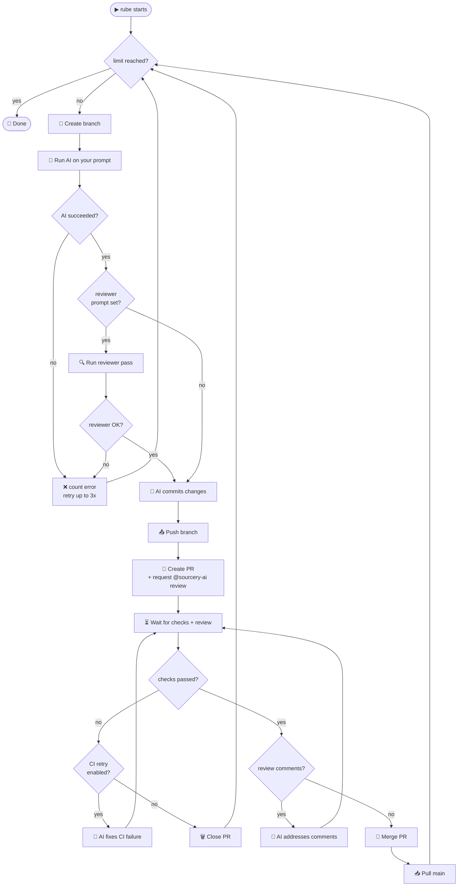
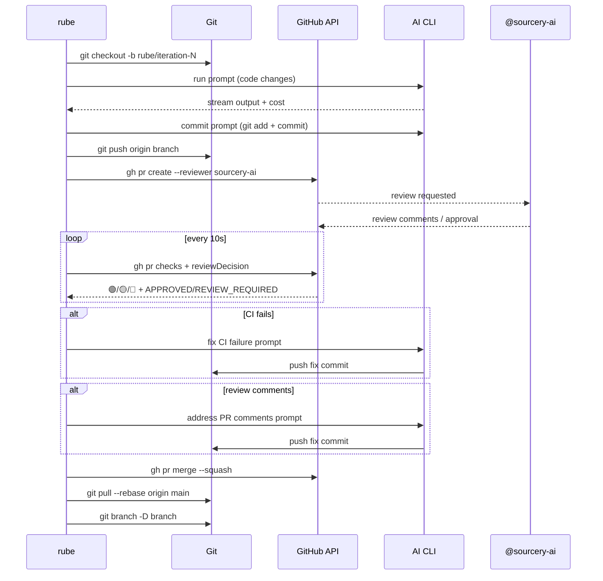
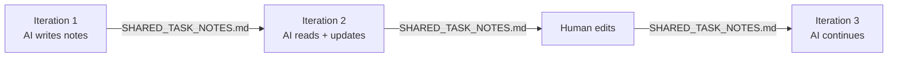

# 🪄 rube

> **rube.works** — the Python-native continuous AI dev loop

Pure Python (stdlib only). **Zero Node.js.** Model-agnostic.  
Automates the full PR lifecycle: code → branch → commit → PR → Sourcery review → CI wait → merge → repeat.

---

## ⚙️ How it works



---

## 🔄 PR lifecycle



---

## 🚀 Quick start

### Install

```bash
curl -fsSL https://raw.githubusercontent.com/flatfinderai-cyber/rube-works/main/rube/install.sh | bash
```

This installs `rube` to `~/.local/bin/rube`. No packages, no npm, no pip.

### Manual install

```bash
curl -fsSL https://raw.githubusercontent.com/flatfinderai-cyber/rube-works/main/rube/rube.py -o rube
chmod +x rube
sudo mv rube /usr/local/bin/
```

### Prerequisites

| Tool | Purpose | Install |
|------|---------|---------|
| Python 3.8+ | Runs rube | [python.org](https://python.org) |
| `git` | Branch management | System package manager |
| `gh` CLI | PR creation + merge | [cli.github.com](https://cli.github.com) — then `gh auth login` |
| AI CLI | Code generation | `claude`, `aider`, `codex`, etc. |

---

## 📖 Usage

```
rube -p "<prompt>" (-m <runs> | --max-cost <usd> | --max-duration <time>) [options]
```

### Limits (at least one required)

| Flag | Description |
|------|-------------|
| `-m, --max-runs N` | Max successful iterations (`0` = unlimited with another limit) |
| `--max-cost N.NN` | Stop when USD spend reaches this amount |
| `--max-duration Xh/Ym/Zs` | Stop after this wall-clock time (e.g. `2h`, `30m`, `1h30m`) |

### AI command

| Flag | Default | Description |
|------|---------|-------------|
| `--ai-cmd` | `claude` | AI CLI to invoke (`aider`, `codex`, or any other) |
| `--ai-flags` | _(claude defaults)_ | Space-separated flags forwarded to the AI CLI |
| `--ai-output-format` | `stream-json` | `stream-json` (Claude) or `text` (everything else) |

### GitHub

| Flag | Default | Description |
|------|---------|-------------|
| `--owner` | auto-detected | GitHub org/user |
| `--repo` | auto-detected | Repository name |
| `--merge-strategy` | `squash` | `squash`, `merge`, or `rebase` |
| `--reviewers` | `sourcery-ai` | Comma-separated PR reviewer handles |
| `--no-sourcery-review` | — | Remove sourcery-ai from reviewers |

### Workflow

| Flag | Default | Description |
|------|---------|-------------|
| `--branch-prefix` | `rube/` | Git branch prefix |
| `--notes-file` | `SHARED_TASK_NOTES.md` | Continuity file passed between iterations |
| `--disable-commits` | — | No commits/PRs (test mode) |
| `--disable-branches` | — | Commit on current branch, skip PRs |
| `--dry-run` | — | Simulate without changes |
| `--completion-signal` | `RUBE_PROJECT_COMPLETE` | Phrase AI outputs when done |
| `--completion-threshold` | `3` | How many consecutive signals to stop |
| `-r, --reviewer <prompt>` | — | Run a reviewer pass after each iteration |
| `--disable-ci-retry` | — | Don't auto-fix failed CI |
| `--ci-retry-max N` | `1` | Max CI fix attempts per PR |
| `--disable-comment-review` | — | Don't auto-address review comments |
| `--comment-review-max N` | `1` | Max comment-fix attempts per PR |

---

## 📝 Examples

```bash
# Basic: run 5 iterations with Claude (default)
rube -p "add unit tests" -m 5

# Cost-capped
rube -p "improve documentation" --max-cost 10.00

# Time-boxed
rube -p "fix all linting errors" --max-duration 2h

# Combine limits (whichever fires first)
rube -p "refactor module" -m 20 --max-cost 5.00 --max-duration 1h

# With aider (no stream-json, plain text output)
rube -p "add docstrings" -m 3 \
     --ai-cmd aider \
     --ai-flags "--yes --no-auto-commits" \
     --ai-output-format text

# With any other AI CLI
rube -p "fix bugs" -m 5 \
     --ai-cmd my-ai-tool \
     --ai-flags "--flag1 value1" \
     --ai-output-format text

# Reviewer pass after each iteration (runs tests, fixes failures)
rube -p "add new feature" -m 5 -r "run pytest and fix any failures"

# No Sourcery review (custom reviewer only)
rube -p "quick fixes" -m 3 --no-sourcery-review

# Custom reviewers
rube -p "add API" -m 5 --reviewers "myteammate,sourcery-ai"

# No commits — just run the AI (useful for testing)
rube -p "suggest improvements" -m 2 --disable-commits

# Commit on current branch, no PRs
rube -p "quick polish" -m 3 --disable-branches

# Use completion signal to stop early
rube -p "add unit tests to all files" -m 50 --completion-threshold 3

# Dry run — see what would happen
rube -p "refactor auth" -m 2 --dry-run
```

---

## 📊 Example output

```
🪄  rube 0.1.0 — rube.works
   AI: claude  |  Repo: myorg/myrepo
   PR reviewers: sourcery-ai
   Completion signal: 'RUBE_PROJECT_COMPLETE'

🔄 (1/5) Starting iteration...
   🌿 Created branch: rube/iteration-1/2026-04-06-be939873
   (1/5) 🤖 Running claude...
   (1/5) 💬 I've added unit tests for the authentication module...
   (1/5) 💰 Cost: $0.042
   Running total: $0.042
   ✅ (1/5) Work completed
   (1/5) 💬 Committing changes...
   📦 Changes committed
   📤 Pushing rube/iteration-1/2026-04-06-be939873...
   (1/5) 🔨 Creating PR...
   (1/5) 🔍 PR #12 created — waiting 5s for GitHub...
   (1/5) 🔍 Checks: 🟢 0  🟡 3  🔴 0  | Review: 1 requested
   (1/5) ⏳ Waiting for 3 check(s) + review
   (1/5) 🔍 Checks: 🟢 3  🟡 0  🔴 0  | Review: APPROVED
   ✅ (1/5) All checks passed and PR approved
   (1/5) 🔀 Merging PR #12...
   ✅ (1/5) PR #12 merged: Add unit tests for auth module

🎉 Done — 5 iteration(s) | total cost: $0.198 | elapsed: 14m32s
```

---

## 🗂 SHARED_TASK_NOTES.md

Each iteration reads and updates `SHARED_TASK_NOTES.md` to pass context between runs.  
This means human developers can edit the file between runs to steer the AI.



---

## 🔒 Security

- rube passes your prompt directly to your chosen AI CLI
- No secrets are stored or transmitted by rube itself
- Use `--disable-commits` to test prompts safely before enabling the full PR loop

---

## 📃 License

MIT — rube.works

---

## 🙏 Inspired by

[continuous-claude](https://github.com/AnandChowdhary/continuous-claude) by Anand Chowdhary —  
rube is a proprietary Python-only reimplementation with model-agnostic support and Sourcery integration.
